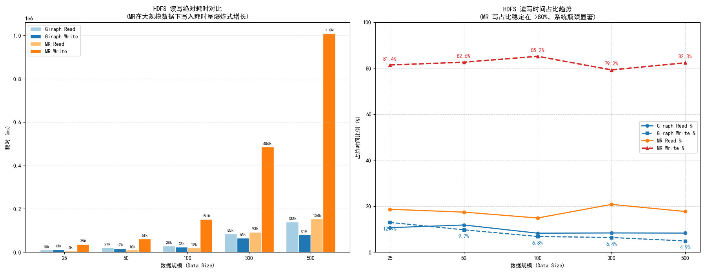

# PageRank 实验报告

```bash

.
└── code/
    ├── giraph-impl/         # Giraph 实现模块
    │   ├── src/             #  Java 源码
    │   ├── pom.xml          # 定义了 Giraph 和 Hadoop 依赖
    │   └── run-giraph.sh    # 封装了提交 Giraph 任务至 YARN 的 shell 脚本
    ├── mapreduce-impl/      # MapReduce 实现模块
    │   ├── src/             # 实现 PageRank 迭代逻辑的 Mapper/Reducer 源码
    │   ├── pom.xml          # 定义了 Hadoop 相关依赖
    │   └── run-mr.sh        # 封装了循环提交 MapReduce 作业的迭代脚本
    ├── input_data/          # 实验输入数据集
    │   └── README.md        # 
    ├── output_data/         # 实验结果存储
    │   ├── metrics.csv      # 指标数据
    │   ├── mapreduce_log_500.txt      # Mapreduce的500MB运行日志
    │   └── README.md        #
    ├── scripts/             # 公共脚本
    │   ├── plot_results.py  # Python 脚本：读取 metrics.csv 并生成性能对比图表
    │   ├── random_data.py   # Python 脚本：用于随机生成不同规模的数据
    │   └── .empty           
    ├── images/              # 存放 README.md 使用的静态图片
    │   └── README.md        # 
    └── README.md            # 项目主说明文档
```

## 研究目的
比较Giraph和MapReduce运行PageRank算法的差异

## 研究内容
对比分析Giraph和MapReduce在执行PageRank算法等图迭代计算任务时的差异，深入理解Giraph所采用的BSP（Bulk Synchronous Parallel）模型的设计理念及其在图计算中的优势。重点探讨两者在数据通信方式、任务调度与执行机制及迭代开销等方面的不同，以及这些差异对算法性能与可扩展性的影响。

## 实验
### 实验环境

- 硬件：
硬件环境为5台云服务器组成的集群，其详细配置如下：

| **节点角色**       | **节点名称 (Hostname)** | **CPU** | **内存 (RAM)** | **操作系统**     | **公网带宽** | 存储类型 |
| ------------------ | ----------------------- | ------- |--------------| ---------------- |----------| -------- |
| **Hadoop Master**  | `hadoop-master`         | 8核     | 16 GiB       | Ubuntu 24.04 LTS | 10 Mbps  | SSD云盘  |
| **Hadoop Slave 1** | `hadoop-slave1`         | 8核     | 16 GiB       | Ubuntu 24.04 LTS | 10 Mbps  | SSD云盘  |
| **Hadoop Slave 2** | `hadoop-slave2`         | 8核     | 16 GiB       | Ubuntu 24.04 LTS | 10 Mbps  | SSD云盘  |
| **ZooKeeper**      | `zookeeper-node`        | 2核     | 2 GiB        | Ubuntu 24.04 LTS | 3 Mbps   | SSD云盘  |
| **Client**         | `hadoop-client`         | 2核     | 2 GiB        |Ubuntu24.04| 10Mbps   | SSD云盘  |

- 软件：

  实验采用docker容器来配置MapReduce和Giraph运行所需的环境。容器内的详细配置如下：

  | **配置项目**      | **详细内容** |
  | ----------------- | ------------ |
  | **操作系统**      | Ubuntu 18.04 |
  | **Hadoop 版本**   | 2.7.7        |
  | **Giraph 版本**   | 1.2.0        |
  | **JDK 版本**      |Openjdk 1.8.0_362    |
  | **Zookeeper版本** | 3.4.14       |

### 实验负载

实验采用以下数据集在MapReduce和Giraph上运行PageRank任务。

| **文件名称**                       | **原始大小（字节）** | **说明大小 (MB)** | **备注**     |
|--------------------------------| -------------------- |---------------|------------|
| `random_pagerank_data_25.txt`  | 25,758,935          | 约 24.56 MB    | 顶点：    边： |
| `random_pagerank_data_100.txt` | 110,056,298          | 约 104.96 MB   | 顶点：    边： |
| `random_pagerank_data_300.txt` | 346,925,030          | 约 330.85 MB   | 顶点：    边： |
| `random_pagerank_data_500.txt` | 583,623,430          | 约 556.59 MB   | 顶点：    边： |
| `web-Google-PR-Init.txt`       | 50,598,489           | 约 48.25 MB    | 顶点：    边： |

数据集的每一行包含3个字段，包括节点ID, Rank值 和当前节点所指向的节点ID。以下是一个数据集示例：

```
A	0.33333334	B,C
B	0.33333334	C
C	0.33333334	A
```


### 实验步骤

#### (一)、搭建Hadoop分布式集群

进入Master容器，执行以下命令启动NameNode，ResourceManager和JobHistoryServer。

```
cd /usr/local/hadoop
./sbin/hadoop-daemon.sh start namenode
./sbin/yarn-daemon.sh start resourcemanager
./sbin/mr-jobhistory-daemon.sh start historyserver
```


进入两个Slave容器，执行以下命令启动DataNode，NodeManager。

```
cd /usr/local/hadoop
./sbin/hadoop-daemon.sh start datanode
./sbin/yarn-daemon.sh start nodemanager
```


通过JPS验证HDFS和MapReduce是否成功启动：


HDFS的Web页面：


Yarn的Web页面


JobHistoryServer的Web页面：


#### (二)、迭代开销：MapReduce 显式状态维护 vs Giraph内存状态常驻

MapReduce 是一种无状态（Stateless）的分布式计算框架，它无法在两个连续的 Job 之间直接通过内存维护状态，只能通过HDFS显式维护迭代计算产生的中间状态：在 PageRank 的每一轮迭代中，MapReduce 必须重新从HDFS上读取图结构数据和Rank值数据，计算完成后再将更新后的数据写回HDFS。这就导致了 HDFS I/O 随迭代次数和数据集规模线性膨胀。而Giraph则直接通过内存维护中间状态，仅需在 Superstep 0 从 HDFS 加载图结构，并在迭代全部结束后将结果一次性写回HDFS，迭代计算产生的中间状态驻留在内存中。


为了探究不同迭代方式对任务执行效率产生的影响，实验使用Giraph和MapReduce在不同规模的数据集上运行PageRank任务，记录Giraph和MapReduce在任务执行时的HDFS读写字节数，并统计MapReduce执行不同任务时读写HDFS的用时。

#### (三)、任务调度与执行机制：MapReduce 静态开销 vs Giraph动态复用

MapReduce将每一轮迭代被封装为一个独立的 YARN 作业。这意味着执行图迭代计算任务时系统需要反复申请释放资源，启动和销毁工作进程。而Giraph 采用**Long-running Worker** 模型，任务在初始化时生成一批Worker进程，后续的计算任务都由这些进程完成，资源只需在第 0 轮（Setup 阶段）申请一次。


为了探究这些差异对性能的影响，实验使用Giraph和MapReduce在不同规模的数据集上运行PageRank任务，然后统计Giraph和MapReduce运行任务时的累计启动延时和运行总时长，采集Giraph和MapReduce在运行时集群的平均内存开销。

#### (四)、数据通信方式：MapReduce 阻塞式Shuffle vs Giraph异步消息传递

MapReduce采用Shuffle机制实现Map和Reduce之间的数据通信，但这种方式存在同步阻塞：划分给某个Map任务的图顶点需要等待Map任务处理完全部的输入，并生成最终的结果文件，才能被Shuffle传输到对应Reduce任务；同时Reduce任务需要等待Shuffle传输的Map结果的数量达到阈值后才能开始工作。因此同一Map任务下的不同图顶点之间存在阻塞，不同Map任务之间也可能互相阻塞。而Giraph采用了异步消息机制，使得每个顶点完成计算后即可发送消息传输数据，尽可能避免了顶点之间的阻塞。


为了探究通信方式差异对性能的影响，实验使用Giraph和MapReduce在`random_pagerank_data_300.txt`数据集上迭代一轮，采集Giraph和MapReduce在任务执行时的网络带宽使用情况。另外让Giraph和MapReduce在不同规模的数据集上运行PageRank任务，统计MapReduce平均每轮的Shuffle耗时与Giraph 平均每轮的等待网络I/O的时间。

### 实验结果与分析

#### (一)、迭代开销

##### 实验结果数据概览：

| 数据规模 | 框架      | HDFS_Bytes_Read | HDFS_Bytes_Written |
| -------- | --------- | --------------- | ------------------ |
| 25MB     | Giraph    | 25759067        | 7780367            |
|          | MapReduce | 246710969       | 245414879          |
| 50MB     | Giraph    | 50598621        | 17140808           |
|          | MapReduce | 464260404       | 466324671          |
| 100MB    | Giraph    | 110060526       | 31730843           |
|          | MapReduce | 1057052275      | 1051872802         |
| 300MB    | Giraph    | 346945642       | 98522872           |
|          | MapReduce | 3331703547      | 3313567550         |
| 500MB    | Giraph    | 583656330       | 164359718          |
|          | MapReduce | 10636326750     | 10609680074        |

| 数据规模 | 框架      | HDFS_Read 用时 | HDFS_Write用时 | 读取用时占比 | 写入用时占比 |
| -------- | --------- | -------------- | -------------- | ------------ | ------------ |
| 25MB     | Giraph    | 10963          | 13328          | 10.63%       | 12.92%       |
|          | MapReduce | 5791           | 35929          | 18.62%       | 81.38%       |
| 50MB     | Giraph    | 21145          | 17390          | 11.81%       | 9.71%        |
|          | MapReduce | 10527          | 61712          | 17.41%       | 82.59%       |
| 100MB    | Giraph    | 28874          | 23861          | 8.24%        | 6.81%        |
|          | MapReduce | 19769          | 151575         | 14.85%       | 85.15%       |
| 300MB    | Giraph    | 85515          | 65083          | 8.35%        | 6.36%        |
|          | MapReduce | 93111          | 486379         | 20.76%       | 79.24%       |
| 500MB    | Giraph    | 138738         | 81541          | 8.29%        | 4.87%        |
|          | MapReduce | 154012         | 1010476        | 17.67%       | 82.33%       |


HDFS读写字节数对比：


HDFS用时分析：




**解释与分析**：

实验结果显示，在不同规模的数据集测试中，MapReduce的HDFS读写总量都远高于Giraph。尤其在 500MB 数据集下，MapReduce 的 HDFS 总读取量达到 **10.6GB**，写入量达到 **10.6GB**；而 Giraph 分别仅为 **0.58GB** 和 **0.16GB**。MapReduce 的吞吐量是 Giraph 的 **20 倍**左右。这是因为 MapReduce 的迭代计算是无状态的，它必须在每一轮迭代结束时将整个图的状态（顶点权值）写回 HDFS，并在下一轮开始时重新读取。任务执行时的HDFS的吞吐量会随迭代次数和数据集规模线性增长。而Giraph使用内存维护中间状态，仅在 Superstep 0 从HDFS上读取输入数据，在 最后一轮迭代结束后将结果写回HDFS，避免了迭代过程中不必要的HDFS I/O。此外，巨量的HDFS I/O也成为MapReduce的性能瓶颈。随着数据规模从 25MB 增加到 500MB，MapReduce 的 HDFS 写入时间从 **35.9s 暴涨到 1010s**，写入时间占据总运行时间的比例能够达到80%。从HDFS写入时间的非线性增长趋势可以看出，MapReduce在处理大规模图迭代计算任务的效率将十分低下 。而Giraph由于仅在任务开始和结束时进行HDFS I/O操作，其HDFS I/O耗时增长与数据量保持了更好的线性关系，执行图迭代任务的可扩展性比MapReduce更强。


#### (二)、任务调度与执行机制

##### 实验结果数据概览：

| 数据规模 |   框架    | 总运行时间 (s) | 累积启动延时 (s) | 启动延时占比 (%) | 内存开销 |
| :------: | :-------: | :------------: | :--------------: | :--------------: | :------: |
|   25MB   |  Giraph   |      108       |        3         |      2.78%       |   5380   |
|          | MapReduce |      547       |        57        |      10.42%      |   9216   |
|   50MB   |  Giraph   |      185       |        2         |      1.08%       |   8412   |
|          | MapReduce |      835       |        50        |      5.99%       |  11264   |
|  100MB   |  Giraph   |      355       |        2         |      0.56%       |   9947   |
|          | MapReduce |      1843      |        55        |      2.98%       |  14336   |
|  300MB   |  Giraph   |      1028      |        3         |      0.29%       |  18409   |
|          | MapReduce |      5158      |        63        |      1.22%       |  19456   |
|  500MB   |  Giraph   |      1678      |        2         |      0.12%       |  22396   |
|          | MapReduce |     20537      |        65        |      0.32%       |  23552   |

Giraph和MapReduce的任务累计启动延时对比


Giraph和MapReduce的内存开销对比：


GC时间占CPU时间比例：


**解释与分析**：

实验结果显示，MapReduce的累计启动延时显著高于Giraph，在 500MB 实验中，MapReduce 的累积启动延时（65s）是 Giraph（2s）的 **32 倍**以上。这是因为 MapReduce 在执行PageRank任务时，每一轮迭代都是一个独立的作业，迭代的每一轮都要经历 `资源申请 -> 启动 AM -> 分发任务 -> 启动 Container` 的全过程。这种“任务级”调度导致了显著的**启动开销累加**。Giraph则将整个任务视为一个单独的应用，只需要在任务开始时申请资源，启动Container，之后的每一轮迭代都可以在这些工作进程中进行，充分复用了已有的资源，避免了启动开销不断累加。另外，在内存开销方面，在实验测试的所以数据规模下，Giraph的内存占用始终低于MapReduce。这似乎并不符合常理，Giraph在执行PageRank任务时需要在内存中维护图结构数据和不断更新的Rank值，不是应该更费内存吗？这可以从以下几方面解释：1. MapReduce 为了实现并行，每轮都会启动多个独立的 Map/Reduce 任务进程。每个 JVM 进程都有固定的元数据和线程栈开销，这种**碎片化的资源申请**导致了总内存足迹（Memory Footprint）的膨胀。而Giraph 将图结构常驻内存且高度序列化。由于只有一个长生存期的 JVM，它避免了反复申请大块 Shuffle 缓冲区（Buffer）的开销。2. MapReduce 在 Shuffle 阶段会产生海量的临时 Key-Value 对象，这些对象在每一轮迭代后都被丢弃，这加剧了Shuffle阶段的内存占用。Giraph 在内存中就地更新顶点值，而不需要不断销毁重建对象。Shuffle阶段大量对象被丢弃会导致JVM频发触发GC。实验额外收集了MapReduce和Giraph运行时的GC耗时占cpu运行时间的比例，结果显示不同数据规模下MapReduce的GC耗时比例都高于Giraph,  MapReduce的GC确实触发的更加频发，以上想法得到了很好的印证。3. 从内存占用图像可以看出，Giraph的内存占用随数据集规模增长的速度明显比MapReduce要更快，在500MB数据集的测试中二者的内存开销已经很接近了，可以预见如果数据集的规模进一步增长到GB级别，Giraph的内存占用会超过MapReduce。但限于实验环境内存有限，未能在更大规模的数据集上进行测试验证这一想法。


#### (三)、数据通信模式

##### 实验结果数据概览：

| 数据规模 | 框架      | I/O等待时间(ms) |
| -------- | --------- | --------------- |
| 25MB     | Giraph    | 5966.17         |
|          | MapReduce | 9354.0          |
| 50MB     | Giraph    | 11992.66        |
|          | MapReduce | 18586.33        |
| 100MB    | Giraph    | 27291.5         |
|          | MapReduce | 70297.33        |
| 300MB    | Giraph    | 82195.05        |
|          | MapReduce | 119654.89       |
| 500MB    | Giraph    | 136707.83       |
|          | MapReduce | 213321.22       |

| 数据集规模 | Giraph消息 (MB) | MapReduce Shuffle (MB) |
| ---------- | --------------- | ---------------------- |
| 25MB       | 120.5           | 460.2                  |
| 50MB       | 245.3           | 920.8                  |
| 100MB      | 498.7           | 1850.5                 |
| 300MB      | 1520.4          | 5600.3                 |
| 500MB      | 2580.2          | 9450.7                 |

| 指标规模   | Giraph (BSP 模型) | MapReduce (Dataflow 模型) |
| ---------- | ----------------- | ------------------------- |
| 平均吞吐量 | 2743 kB/s         | 1742 kB/s                 |
| 峰值吞吐量 | 6237 kB/s         | 3317 kB/s                 |

Giraph 消息字节数与MapReduceShuffle字节数的对比


MapReduce Shuffle与Giraph网络带宽使用情况对比:


MapReduce的Shuffle耗时和Giraph的waits on requests 时间对比:


**解释与分析**：

实验数据显示，在不同规模的数据集的测试中，MapReduce 的 Shuffle 数据量均高于Giraph的消息传输量，特别是在 500MB 数据规模下，MapReduce 的 Shuffle 数据量高达 **9450.7 MB**，而 Giraph 的消息传输量仅为 **2580.2 MB**。MapReduce 的网络负载是 Giraph 的 **3.66 倍**。其中的原因在于MapReduce是基于磁盘的分布式计算系统，没有像Giraph一样直接将输入的图结构数据驻留在内存中。因此，Shuffle阶段不仅需要传输更新的Rank值，还需要传输图结构数据。又因为MapReduce采用的键值数据模型无法直接表达图拓扑结构，只能以类似邻接表的方式表示图结构信息，这种方式也使得数据存储出现冗余。而Giraph则采用了以顶点为中心的计算模型，并在加载输入数据后直接将图结构信息驻留在内存中，在运行PageRank计算任务时只需传输更新的Rank值数据，进而极大地降低了网络传输的开销。此外，Giraph的网络I/O等待耗时也明显低于MapReduce，在 500MB 规模下，MapReduce 的平均 Shuffle 等待时间为 **213.3s**，而 Giraph 的平均网络请求等待时间（Wait on requests）仅为 **136.7s**。因为MapReduce 的 Shuffle 采用“拉取（Pull）”模型，Reducer 必须等待足够数量的Map任务完成并拷贝完数据后才能开始。同时，每个Map任务需要完成其所有输入的图顶点的处理，生成最后的结果文件，才能让每个图顶点被拉取到对应的Reducer。总得来说，MapReduce执行PageRank任务时不同图顶点之间存在同步阻塞，这就使得在Map阶段即使I/O资源是空闲的，未完成的Map任务中已经处理完毕的图顶点也无法被拉取到对应Reducer；而在Shuffle和Reduce阶段，即使cpu是空闲的，尚未拉取完所需的数据的Reducer也无法开始工作，I/O和CPU总是在互相等待。这种阻塞式数据传输导致了MapReduce执行任务时存在较长的I/O等待时间，同时也降低了MapReduce运行时的资源利用率。而Giraph 则采用了BSP异步消息传递机制，每个顶点完成计算后即可通过异步消息向其他顶点传输数据。不同顶点之间的计算和消息传递互不阻塞，这样Giraph在进行一部分顶点的计算任务的同时还在后台通过网络传输其他顶点的消息。这就使得Giraph的计算和消息相互重叠，网络I/O用时得到了有效的掩盖，显著地降低了总体的I/O等待时间。从监测到的网络带宽使用数据可以印证这一点，由于不同顶点的网络I/O不存在阻塞，Giraph能更充分地利用网络带宽，其平均网络吞吐量达到MapReduce的1.5倍，峰值吞吐量达到了MapReduce的接近2倍。


### 结论
1. Giraph 的 **Long-running Worker** 模型 彻底消除了 MapReduce 每一轮迭代必须进行的作业提交、资源申请和 JVM 启动开销。在 500MB 规模下，Giraph 将累积调度延时从 MapReduce 的 65 秒降低至 2 秒（缩减约 97%）。而且通过对象复用和资源的集中申请等优化策略，Giraph有效降低了内存足迹，在小规模计算任务上对比MapReduce获得了内存开销上的优势。
2. MapReduce 强制性的“每轮落盘（Checkpointing）”机制是其性能瓶颈的根源。数据表明，当数据规模达到500MB时，MapReduce 的 HDFS 读写总量就已经是 Giraph 的 **20 倍**左右。而Giraph 通过 **内存常驻图拓扑**，将迭代期间的 HDFS I/O 降至近乎为零，成功打破了“存储墙”对计算速度的限制。
3. 在数据通信方面，Giraph 的消息传递效率远超 MapReduce 的 Shuffle。Giraph 在内存中维护图结构信息，避免了额外的网络通信，将物理通信量降低了约 **70%**（仅传输权值而非全量图数据），还利用 **异步通信** 实现了计算与通信的时间重叠，有效降低了通信等待时间。

4. 随着数据规模从 25MB 增长到 500MB，MapReduce 的总耗时呈**非线性爆发式增长**，而 Giraph 保持了良好的**线性扩展性**。实验最终证实：PageRank 这种高频率、强依赖消息传递的图迭代算法，基于内存的 BSP 专用图计算框架Giraph对比基于磁盘的通用分布式计算系统MapReduce具有碾压级的性能表现。

### 分工

易志鹏：hadoop集群搭建 giraph环境部署，实验方案总体设计，giraph相关实验运行与数据收集（贡献度34%）

莫易新：尝试 Apache Giraph 在本地环境的部署与配置，基于 PageRank 算法的计算任务调试，并构建 GitHub 版本控制仓库进行项目管理，撰写最终实验结论。（贡献度22%）

潘飞扬：寻找并构建数据集，尝试giraph的构建，运行MapReduce的实验，部分实验数据分析（贡献度22%）

俞言骐：mapreduce上的pagerank算法实现、部分性能监测脚本的实现、部分实验数据分析（贡献度22%）
