# 作业提交模板

```bash

.
└── code/
    ├── giraph-impl/         # Giraph 实现模块
    │   ├── src/             #  Java 源码
    │   ├── pom.xml          # 定义了 Giraph 和 Hadoop 依赖
    │   └── run-giraph.sh    # 封装了提交 Giraph 任务至 YARN 的 shell 脚本
    ├── mapreduce-impl/      # MapReduce 实现模块
    │   ├── src/             # 实现 PageRank 迭代逻辑的 Mapper/Reducer 源码
    │   ├── pom.xml          # 定义了 Hadoop 相关依赖
    │   └── run-mr.sh        # 封装了循环提交 MapReduce 作业的迭代脚本
    ├── input_data/          # 实验输入数据集
    │   └── README.md        # 
    ├── output_data/         # 实验结果存储
    │   ├── metrics.csv      # 指标数据
    │   ├── mapreduce_log_500.txt      # Mapreduce的500MB运行日志
    │   └── README.md        #
    ├── scripts/             # 公共脚本
    │   ├── plot_results.py  # Python 脚本：读取 metrics.csv 并生成性能对比图表
    │   ├── random_data.py   # Python 脚本：用于随机生成不同规模的数据
    │   └── .empty           
    ├── images/              # 存放 README.md 使用的静态图片
    │   └── README.md        # 
    └── README.md            # 项目主说明文档
```

## 研究目的
比较Giraph和MapReduce运行PageRank算法的差异

## 研究内容
对比分析Giraph和MapReduce在执行PageRank算法等图迭代计算任务时的差异，深入
理解Giraph所采用的BSP（Bulk Synchronous Parallel）模型的设计理念及其在图计算中的优势。
重点探讨两者在数据通信方式、任务调度机制及迭代开销等方面的不同，以及这些差异对算法性能
与可扩展性的影响。
### 1. 迭代方式
- Giraph: 图迭代计算视为一个任务，节点工作进程常驻，只需要在任务开始和结束时从HDFS上读取输入，写入输出
- MapReduce: 一轮迭代视为一个任务，迭代过程会反复启动和销毁任务进程，每轮迭代都需要从HDFS上读取输入、写入输入
25m~500m
    - 对比Giraph和MapReduce的任务启动延时(Start Time - Submited Time)
    - 对比Giraph和MapReduce读写HDFS的字节数
    - 对比Giraph和MapReduce读写HDFS的用时

### 2. 数据与计算模型
- Giraph：以图数据结构为数据模型，采用以顶点为中心的计算模型，在顶点上定义计算方法，顶点完成计算后沿着顶点之间的边传输消息。支持图数据的直接表示，输入数据经过加载后形成图结构数据，驻留在内存中，数据通信只需传输Rank值，不需要传输图结构。
- MapReduce：以键值数据结构作为数据模型，计算分成两个阶段：map:对键值转化和分组 ；reduce:对相同键的数据进行合并。无法直接表示图数据，只能将图数据转化为键值形式，这会导致部分数据冗余存储。加之MapReduce是无状态计算，图结构不会驻留内存，每轮迭代需要在HDFS上加载和写入图结构数据，每次Shuffle不仅需要传输Rank值，还要传输图结构。
25m~500m
    - 对比Giraph发送的消息字节数和MapReduce的Shuffle字节数。
    - 对比Giraph和MapReduce的内存开销。
    - 绘制MapReduceHDFS读写字节数与任务规模的关系。
### 3. 数据通信:
- Giraph:采用BSP同步和Message消息传递，不同顶点之间并发处理，每个顶点的compute()计算完成后就可以调用sendMessage()发送消息传递数据，最终通过BSP同步所以顶点的计算和通信，Giraph能够更充分地利用I/O资源。
- MapReduce: 采用Shuffle机制实现Map任务和Reduce任务之间的数据传输，一个Map任务需要完成全部图顶点的处理才能进入Shuffle阶段，最先被处理的图顶点将被阻塞直到Map任务完成，此过程将会导致I/O资源的浪费。
100m 迭代5轮
    - 对比Giraph和MapReduce在运行时的网络I/O使用情况。
25m~500m
    - 对比MapReduce的Shuffle耗时和Giraph每个SuperStep的栅栅同步时间(Barrier)

### 4.**可拓展性差异**
-  数据可拓展性：固定Worker数量，增加图规模
Metrics : 总作业时间、系统总体资源占用率
-  水平可拓展性: 固定数据规模(大规模图)，增加节点数量
Metrics : 加速比 ，资源利用率 

## 实验
### 实验环境
节点数：4个
#### 节点配置
Hadoop/Giraph 集群节点配置汇总表

|**节点角色**|**节点名称 (Hostname)**|**CPU**|**内存 (RAM)**|**操作系统**|**公网带宽**|**磁盘配置**|
|---|---|---|---|---|---|---|
|**Hadoop Master**|`hadoop-master`|8核|16 GiB|Ubuntu 24.04 LTS|10 Mbps|50GB 增强型 SSD|
|**Hadoop Slave 1**|`hadoop-slave1`|8核|16 GiB|Ubuntu 24.04 LTS|10 Mbps|50GB 增强型 SSD|
|**Hadoop Slave 2**|`hadoop-slave2`|8核|16 GiB|Ubuntu 24.04 LTS|10 Mbps|50GB 增强型 SSD|
|**ZooKeeper**|`zookeeper-node`|2核|2 GiB|Ubuntu 24.04 LTS|3 Mbps|50GB 通用型 SSD|

### 软件环境配置表

|**配置项目**|**详细内容**|
|---|---|
|**部署方式**|Docker 部署 (手工制作镜像)|
|**x86 镜像地址**|`docker pull frestrain/pagerank:x86`|
|**Arm 镜像地址**|`docker pull frestrain/pagerank:arm`|
|**操作系统**|Ubuntu 18.04|
|**Hadoop 版本**|3.3.6|
|**JDK 版本**|OpenJDK 11|
|**Giraph 版本**|Giraph 2.7|


### 实验负载
#### 1.数据结构（邻接表）
|**字段**|**含义**|**示例**|**作用**|
|---|---|---|---|
|**节点 ID (Node ID)**|当前页面的唯一标识|`0`|标识当前权重所属的对象|
|**PR Score**|节点的当前重要性分数|`0.0000025`|迭代计算的核心数值，随迭代更新|
|**当前节点的指向的节点**|该页面指向的所有链接|`124543, 172009...`|决定了 PR 值将分发给哪些节点|
#### 2.使用的数据集（pagerank数据）
|**文件名称**|**原始大小（字节）**|**说明大小 (MB)**|**备注**|
|---|---|---|---|
|`random_pagerank_data_100.txt`|110,056,298|约 104.96 MB|中型测试数据集|
|`random_pagerank_data_300.txt`|346,925,030|约 330.85 MB|大型数据集|
|`random_pagerank_data_500.txt`|583,623,430|约 556.59 MB|超大型数据集|
|`web-Google-PR-Init.txt`|50,598,489|约 48.25 MB|初始化/真实提取数据|
### 实验步骤
列出执行实验的关键步骤，并对关键步骤进行截图，如 MapReduce / Spark / Flink 部署成功后的进程信息、作业执行成功的信息等，**截图能够通过显示用户账号等个性化信息佐证实验的真实性**。

#### 第一阶段：环境搭建与准备
1. **基础集群部署：** 搭建Hadoop分布式集群，配置 Hadoop 的 yarn-site.xml 和 mapred-site.xml。确保其 Zookeeper 能够正常协调各 Worker。如下是Hadoop的Overview。
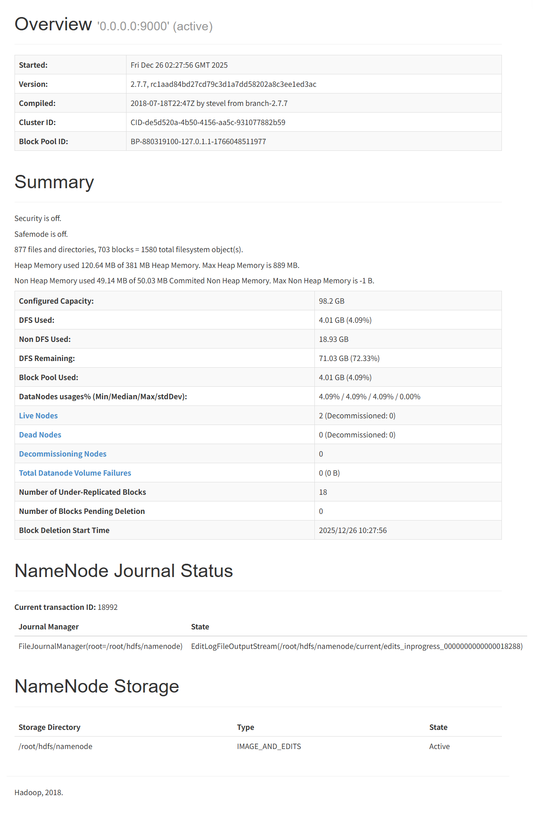

2.**环境检查：** 环境环境验证 java -version、hadoop version 和 giraph 命令是否正常。
3. **测试:** 在单机下跑pagerank和 Giraph 自带的 SimpleShortestPathsComputation，确保计算框架链路通畅。
4. 如下是Master和Slave的JPS截图

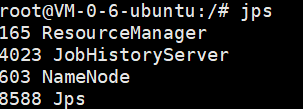
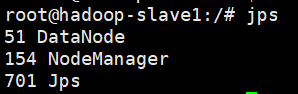


#### 第二阶段：算法编程实现
1. **MapReduce 版实现：**
   
2. **Giraph (BSP) 版实现：**
---
#### 第三阶段：数据集准备与预处理
1. **数据选取：** 准备三个不同规模的图数据集以及真实提取数据集
    - 将原始数据转换为邻接表格式（确保Mapreduce和Giraph在同一负载下)
    - 确保两套系统使用相同的输入源，以保证实验的公平性。
---
#### 第四阶段：实验运行与数据采集
1. **预实验：** 在小规模数据集上测试，验证两个版本PageRank的计算结果是否一致。
2. **正式实验：**
    - **维度 A（迭代次数）：** 固定数据集，改变迭代次数（如 10, 20, 50 次），记录执行时间。
    - **维度 B（数据规模）：** 固定迭代次数，改变节点和边数，观察作业的可扩展性。
3. **性能指标采集：**
    - **作业总时长：** 从提交到任务结束的时间。
    - **迭代间隙开销：** 记录 MapReduce 频繁读写 HDFS 产生的 I/O 耗时。
    - **网络通信量：** 记录 Giraph 在 BSP 同步点（Barrier）前后的网络流量。
4. **数据收集**
    - 我们部署了JobHIstory来监控Mapreduce的每一轮迭代与Giraph的运行指标。
    - 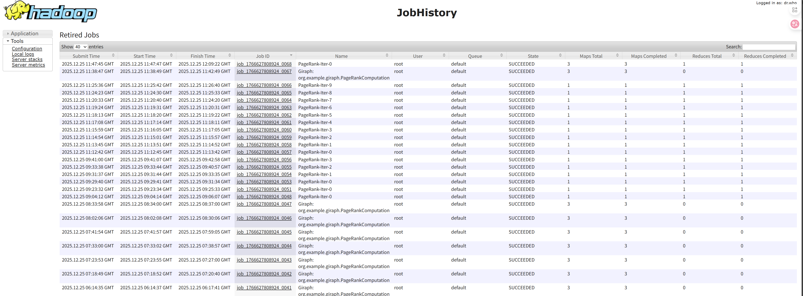
    - 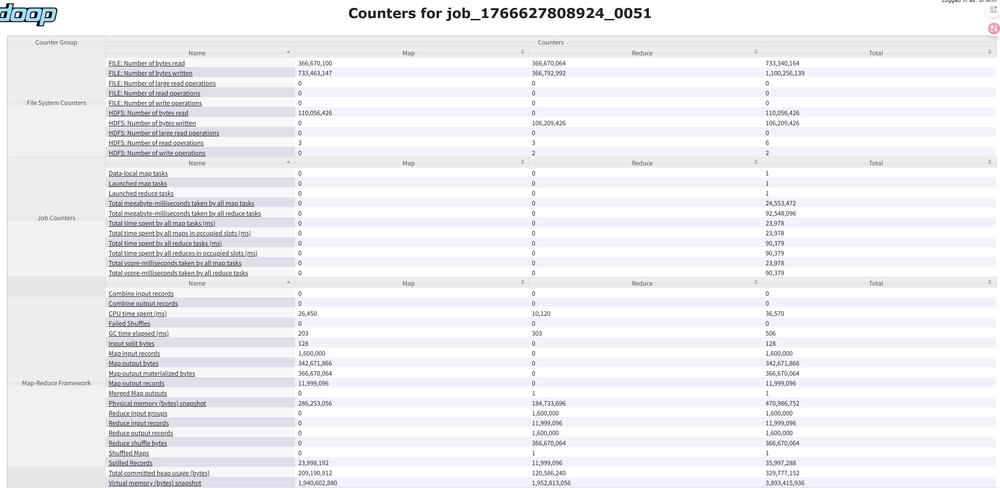

---

#### 第五阶段：对比分析与结论撰写
1. **执行效率分析：** * 对比发现 Giraph 在迭代计算中由于 **数据驻留内存** 和 **无需频繁启动 Job**，其性能通常远优于 MapReduce。
2. **编程复杂度总结：**
    - 分析 Giraph “以顶点为中心”的编程模式是否比 MapReduce 的拆分逻辑更直观。
3. **BSP 模型深度剖析：**
    - 结合实验数据，解释 **超级步（Superstep）** 机制如何通过内存消息传递取代了 MapReduce 繁重的 **Shuffle-to-Disk** 过程。
4. **可扩展性讨论：**
    - 观察当数据规模超出内存容量时，Giraph 的表现是否会大幅下降（触发 Spill），从而分析其局限性。
### 实验结果与分析
#### 1.迭代方式
##### 1.1 对比Giraph和MapReduce的任务启动延时(Start Time - Submited Time)
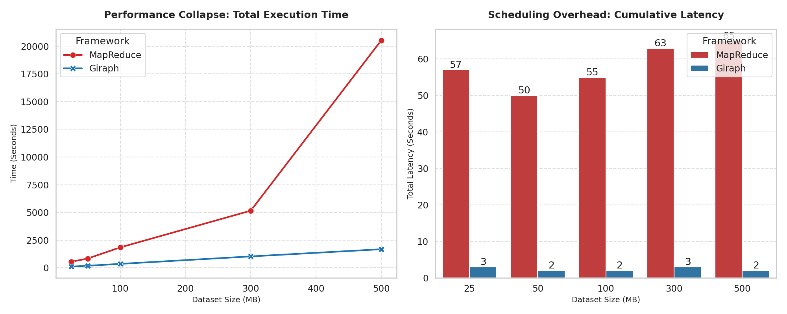
##### 1.2 对比Giraph和MapReduce读写HDFS的字节数和读写时间
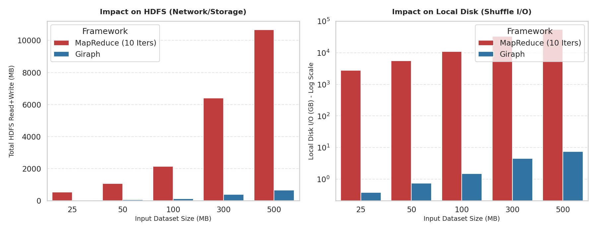
#### 2.数据与计算模型
##### 2.1 对比Giraph发送的消息字节数和MapReduce的Shuffle字节数
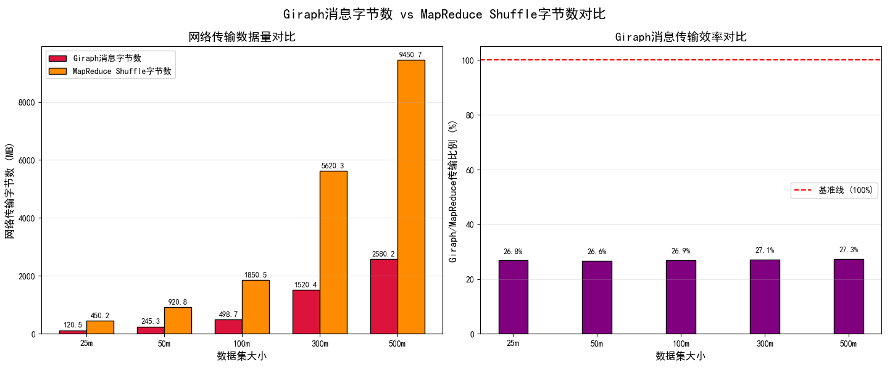
##### 2.2 对比Giraph和MapReduce的内存开销
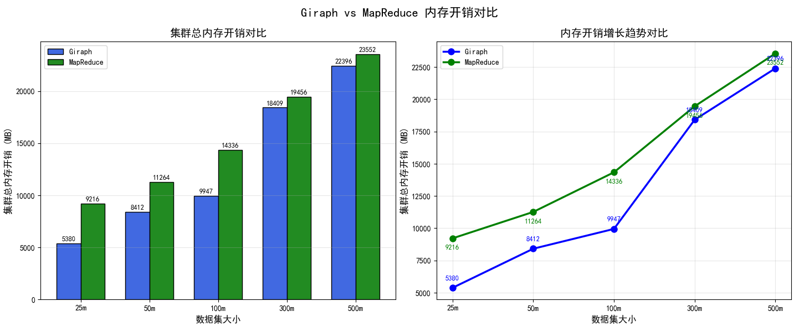
##### 2.3 绘制MapReduceHDFS读写字节数与任务规模的关系
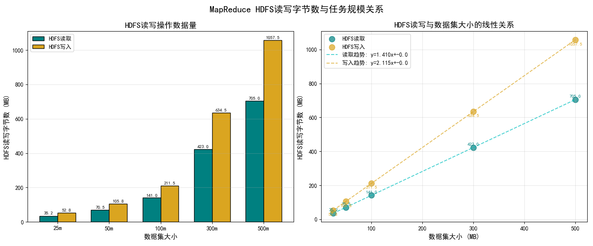
#### 3.数据通信
##### 3.1 对比Giraph和MapReduce在运行时的网络I/O使用情况
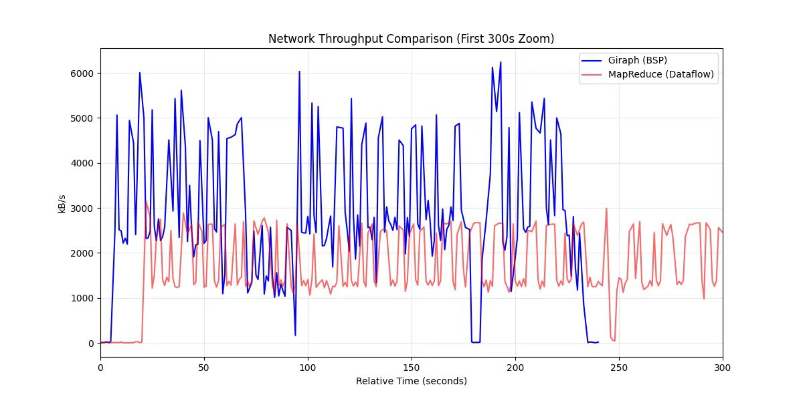
##### 3.2 对比MapReduce的Shuffle耗时和Giraph每个SuperStep的栅栅同步时间(Barrier)
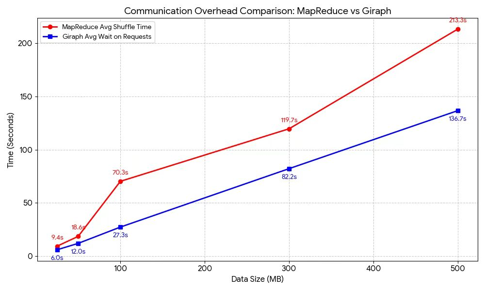

### 结论
总结研究的主要发现。
### 分工
尽可能详细地写出每个人的具体工作和贡献度，并按贡献度大小进行排序。


