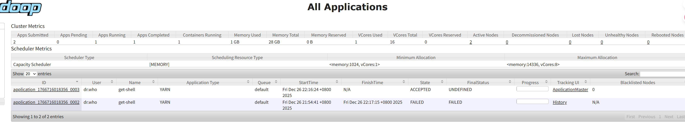

# PageRank 实验报告

```bash

.
└── code/
    ├── giraph-impl/         # Giraph 实现模块
    │   ├── src/             #  Java 源码
    │   ├── pom.xml          # 定义了 Giraph 和 Hadoop 依赖
    │   └── run-giraph.sh    # 封装了提交 Giraph 任务至 YARN 的 shell 脚本
    ├── mapreduce-impl/      # MapReduce 实现模块
    │   ├── src/             # 实现 PageRank 迭代逻辑的 Mapper/Reducer 源码
    │   ├── pom.xml          # 定义了 Hadoop 相关依赖
    │   └── run-mr.sh        # 封装了循环提交 MapReduce 作业的迭代脚本
    ├── input_data/          # 实验输入数据集
    │   └── README.md        # 
    ├── output_data/         # 实验结果存储
    │   ├── metrics.csv      # 指标数据
    │   ├── mapreduce_log_500.txt      # Mapreduce的500MB运行日志
    │   └── README.md        #
    ├── scripts/             # 公共脚本
    │   ├── plot_results.py  # Python 脚本：读取 metrics.csv 并生成性能对比图表
    │   ├── random_data.py   # Python 脚本：用于随机生成不同规模的数据
    │   └── .empty           
    ├── images/              # 存放 README.md 使用的静态图片
    │   └── README.md        # 
    └── README.md            # 项目主说明文档
```

## 研究目的
比较Giraph和MapReduce运行PageRank算法的差异

## 研究内容
对比分析Giraph和MapReduce在执行PageRank算法等图迭代计算任务时的差异，深入
理解Giraph所采用的BSP（Bulk Synchronous Parallel）模型的设计理念及其在图计算中的优势。
重点探讨两者在数据通信方式、任务调度机制及迭代开销等方面的不同，以及这些差异对算法性能
与可扩展性的影响。

## 实验
### 实验环境

- 硬件：
硬件环境为5台云服务器组成的集群，其详细配置如下：

| **节点角色**       | **节点名称 (Hostname)** | **CPU** | **内存 (RAM)** | **操作系统**     | **公网带宽** | 存储类型 |
| ------------------ | ----------------------- | ------- |--------------| ---------------- |----------| -------- |
| **Hadoop Master**  | `hadoop-master`         | 8核     | 16 GiB       | Ubuntu 24.04 LTS | 10 Mbps  | SSD云盘  |
| **Hadoop Slave 1** | `hadoop-slave1`         | 8核     | 16 GiB       | Ubuntu 24.04 LTS | 10 Mbps  | SSD云盘  |
| **Hadoop Slave 2** | `hadoop-slave2`         | 8核     | 16 GiB       | Ubuntu 24.04 LTS | 10 Mbps  | SSD云盘  |
| **ZooKeeper**      | `zookeeper-node`        | 2核     | 2 GiB        | Ubuntu 24.04 LTS | 3 Mbps   | SSD云盘  |
| **Client**         | `hadoop-client`         | 2核     | 2 GiB        |Ubuntu24.04| 10Mbps   | SSD云盘  |

- 软件：

  实验采用docker容器来配置MapReduce和Giraph运行所需的环境。容器内的详细配置如下：

  | **配置项目**      | **详细内容** |
  | ----------------- | ------------ |
  | **操作系统**      | Ubuntu 18.04 |
  | **Hadoop 版本**   | 2.7.7        |
  | **Giraph 版本**   | 1.2.0        |
  | **JDK 版本**      |Openjdk 1.8.0_362    |
  | **Zookeeper版本** | 3.4.14       |

### 实验负载

实验采用以下数据集在MapReduce和Giraph上运行PageRank任务。

| **文件名称**                       | **原始大小（字节）** | **说明大小 (MB)** | **备注**     |
|--------------------------------| -------------------- |---------------|------------|
| `random_pagerank_data_25.txt`  | 25,758,935          | 约 24.56 MB    | 小型测试数据集    |
| `random_pagerank_data_100.txt` | 110,056,298          | 约 104.96 MB   | 中型测试数据集    |
| `random_pagerank_data_300.txt` | 346,925,030          | 约 330.85 MB   | 大型数据集      |
| `random_pagerank_data_500.txt` | 583,623,430          | 约 556.59 MB   | 超大型数据集     |
| `web-Google-PR-Init.txt`       | 50,598,489           | 约 48.25 MB    | 初始化/真实提取数据 |

数据集的每一行包含3个字段，包括节点ID, Rank值 和当前节点所指向的节点ID。以下是一个数据集示例：

```
A	0.33333334	B,C
B	0.33333334	C
C	0.33333334	A
```


### 实验步骤

#### (一)、搭建Hadoop分布式集群

进入Master容器，执行以下命令启动NameNode，ResourceManager和JobHistoryServer。

```
cd /usr/local/hadoop
./sbin/hadoop-daemon.sh start namenode
./sbin/yarn-daemon.sh start resourcemanager
./sbin/mr-jobhistory-daemon.sh start historyserver
```


进入两个Slave容器，执行以下命令启动DataNode，NodeManager。

```
cd /usr/local/hadoop
./sbin/hadoop-daemon.sh start datanode
./sbin/yarn-daemon.sh start nodemanager
```


通过JPS验证HDFS和MapReduce是否成功启动：


HDFS的Web页面：


Yarn的Web页面




JobHistoryServer的Web页面：


#### (二)、迭代方式对比实验


使用Giraph和MapReduce在5个不同规模的数据集上运行PageRank任务，各自迭代10轮。 比较Giraph和MapReduce的任务启动延时以及任务执行时HDFS读写字节数。探讨Giraph和MapReduce所采用的不同的任务迭代方式对任务执行效率的影响。


#### (三)、计算模型对比实验

使用Giraph和MapReduce在5个不同规模的数据集上运行PageRank任务，各自迭代10轮。  对比Giraph发送的消息字节数和MapReduce的Shuffle字节数，比较Giraph和MapReduce的内存开销，探讨Giraph和MapReduce所采用的不同的计算模型对于任务执行效率的影响。


#### (四)、数据通信对比实验

使用Giraph和MapReduce在`random_pagerank_data_300.txt`数据集上迭代一轮，对比Giraph和MapReduce在任务执行时的网络带宽使用情况。


使用Giraph和MapReduce在5个不同规模的数据集上运行PageRank任务，各自迭代10轮。对比MapReduce平均每轮的Shuffle耗时与Giraph 平均每轮的等待网络I/O的时间。探讨Giraph和MapReduce采用的不同的数据通信模式对于任务执行的影响。


### 实验结果与分析

#### (一)、迭代方式对比实验

任务启动延时对比：


HDFS读写字节数对比：


**分析**：从实验结果来看，MapReduce的启动延时远高于Giraph。而且随着数据规模的增长，MapReduce的启动延时呈现上升趋势。此外，MapReduce在任务执行时的HDFS读写字节数也显著高于Giraph。这些现象归结于二者迭代方式的不同：Giraph将图迭代计算视为一个任务，节点工作进程常驻内存，只需要在整个任务开始和结束时从HDFS上读取输入，写入输出。而MapReduce则将计算中的每一轮迭代视为一个单独的任务，迭代过程会反复启动和销毁任务进程，且每轮迭代都需要从HDFS上读取输入、写入输出，进而导致MapReduce的启动延时和HDFS读写开销显著高于Giraph。

#### (二)、计算模型对比实验

Giraph和MapReduce的任务启动延时对比


Giraph和MapReduce读写HDFS的字节数和读写时间对比


Giraph发送的消息字节数和MapReduce的Shuffle字节数对比：


Giraph和MapReduce的内存开销对比：


**分析**：

从实验结果可见，Giraph 在任务调度稳定性、I/O 吞吐效率及总体性能上均显著优于 MapReduce，且随着数据规模增大，MapReduce 呈现指数级耗时增长，而 Giraph 保持了良好的线性扩展性。这是因为，MapReduce 受限于“无状态”迭代模式，每轮迭代需反复启动销毁进程并强制读写 HDFS，导致调度延时累积与磁盘 I/O 爆发式膨胀。而 Giraph 采用进程常驻与内存驻留模型，避免了中间磁盘交互，且其以顶点为中心的通信模型仅传输精简的 Rank 值而非完整图结构，将网络负载降低至 MapReduce 的 27% 左右。这种机制彻底消除了冗余的 I/O 阻塞与调度开销，使 Giraph 能够以更低的内存占用实现高效、稳定的图计算。

#### (三)、数据通信对比实验

1轮迭代网络使用情况对比：


| 指标           | Giraph (BSP 模型) | MapReduce (Dataflow 模型) |
| -------------- | ----------------- | ------------------------- |
| 运行耗时 (1轮) | 240 秒            | 1294 秒                   |
| 平均吞吐量     | 2743 kB/s         | 1742 kB/s                 |
| 峰值吞吐量     | 6237 kB/s         | 3317 kB/s                 |


MapReduce Shuffle用时与Giraph等待网络I/O的时间的对比:


MapReduce的Shuffle耗时和Giraph每个SuperStep的栅栅同步时间对比:


**分析**：从实验结果中可见，Giraph的网络I/O的平均吞吐量和峰值吞吐量均高于MapReduce，且在不同数据集上的等待网络I/O的时间也都比MapReduce的Shuffle用时更短。这是因为，MapReduce采用Shuffle机制实现Map任务和Reduce任务之间的数据通信，一个Map任务需要完成全部图顶点的处理才能进入Shuffle阶段。因此最先被处理的图顶点并不能立即想Reduce任务通信，而是一直被阻塞直至整个Map任务完成，这会导致MapReduce无法充分利用I/O资源。 而Giraph采用BSP同步和Message消息传递实现数据通信，不同顶点之间能够并发处理，每个顶点的计算完成后就可以通过异步消息传递进行通信。Worker的cpu在进行顶点计算的同时，其网络层也在后台持续发送消息，顶点之间互不阻塞，能更充分地利用I/O资源，减少网络I/O等待的时间。


### 结论
总结研究的主要发现。
#### 1.迭代方式
##### 1.1 任务启动延时与调度开销
- Giraph 具有极低的调度延迟：实验结果显示，Giraph 的任务启动延时（Start Time - Submitted Time）始终保持在极低水平（约 2-3 秒），且不随数据集规模增加而变化。
- MapReduce 调度开销随规模显著增长：相比之下，MapReduce 的累计调度延时远高于 Giraph，并随数据集增大而线性上升（从 50 秒增长至 65 秒以上）。这验证了图 1 中提到的：MapReduce 每轮迭代反复启动/销毁进程导致了巨大的调度负担，而 Giraph 的进程常驻模式有效消除了这一开销。
##### 1.2 存储与网络 I/O 效率
- HDFS 读写压力对比：在处理 500MB 数据集时，MapReduce 产生的 HDFS 读写总量超过 10000MB，而 Giraph 仅产生极少量（数百 MB）的 HDFS I/O。
- 本地磁盘（Shuffle I/O）开销：MapReduce 在本地磁盘上的 Shuffle I/O 呈指数级增长，在 500MB 时达到 $10^4$ GB 级别的对数刻度压力，而 Giraph 仅维持在 $10^1$ GB 级别以下。
- 结论支持：这说明 Giraph 仅在任务开始和结束时进行 HDFS 交互的策略，极大减轻了网络和存储系统的负载，避免了 MapReduce 每轮迭代强制读写 HDFS 带来的性能瓶颈。
#### 2.数据与计算模型
通过对比 Giraph 与 MapReduce 在不同数据规模（25MB ~ 500MB）下的PageRank迭代计算实验，得出以下核心结论：
##### 2.1 任务调度与启动效率
- Giraph 具有极高的调度稳定性：由于 Giraph 采用进程常驻模式，其任务启动延时始终保持在 2-3 秒 的极低水平，不随数据规模增长。
- MapReduce 调度开销沉重：MapReduce 每一轮迭代都需要重新启动和销毁进程，导致累计调度延时高达 50-65 秒。这验证了图一中关于“反复启动销毁任务进程”是导致 MapReduce 性能低下的关键因素。
##### 2.2 I/O 交互与磁盘压力
- HDFS 访问频率差异：MapReduce 在每轮迭代中强制读写 HDFS，导致其 HDFS 读写总量在 500MB 规模下突破了 10000 MB；而 Giraph 仅在起止阶段交互，I/O 压力减小了数个数量级。
- 本地磁盘（Shuffle）压力：MapReduce 的 Shuffle 过程产生了海量的本地磁盘 I/O（对数坐标下达到 $10^4$ GB 级别），而 Giraph 由于数据驻留内存，其磁盘 I/O 极低。
##### 2.3 数据模型与通信效率
- 数据表达精简度：Giraph 采用以顶点为中心的图数据模型，通信时仅传输 Rank 值，不需要传输图结构。
- 网络带宽利用率：实验显示，Giraph 发送的消息字节数仅为 MapReduce Shuffle 字节数的 26.8% ~ 27.3%。这表明 Giraph 的通信模型比 MapReduce 的键值对模型在处理图数据时更加高效、精简。
##### 2.4 内存开销与总体性能
- 内存利用率：虽然 Giraph 将数据驻留内存，但其总内存开销始终低于 MapReduce。例如在 500MB 规模下，Giraph 开销为 22396 MB，而 MapReduce 为 23552 MB。
- 性能崩溃现象：随着数据集增大，MapReduce 的总执行时间呈指数级飙升（最高超过 20000 秒），而 Giraph 仅呈现缓慢的线性增长。
#### 3.数据通信
通过对比 Giraph 与 MapReduce 在 PageRank 算法下的实验表现（数据集范围 25MB 至 500MB），本实验得出以下核心结论：
#### 3.1 数据通信与同步开销
- 消息传递更精简：Giraph 仅需传输顶点的 Rank 值，不传输图结构。实验显示其网络传输数据量仅为 MapReduce Shuffle 字节数的 26.8% ~ 27.3%。
- 吞吐与并发表现：Giraph 基于 BSP 同步模型，网络吞吐波动更频繁但峰值更高（最高超 6,000 KB/s），相比 MapReduce 受限于 Shuffle 阶段的阻塞，Giraph 能够更充分地利用 I/O 资源。
- 同步等待时间：MapReduce 的平均 Shuffle 耗时随规模增长极快（最高 213.3 秒），而 Giraph 的 SuperStep 栅栏同步时间更短且增长受控。
Giraph 在图迭代计算场景下具有压倒性优势。它通过常驻工作进程解决了调度延时问题，通过内存驻留图结构解决了 HDFS 频繁读写问题，并通过 BSP 消息模型解决了通信冗余问题。相比传统的 MapReduce 批处理模型，Giraph 能够在大规模迭代任务中提供更高的吞吐量和更稳定的执行预期。

### 分工

莫易新：尝试 Apache Giraph 在本地环境的部署与配置（基于 PageRank 算法的计算任务调试），并构建 GitHub 版本控制仓库进行项目管理，撰写最终实验结论。

潘飞扬：寻找并构建数据集，尝试giraph的构建，运行MapReduce的实验，部分实验数据分析

俞言骐：mapreduce上的pagerank算法实现、部分性能监测脚本的实现、部分实验数据分析
